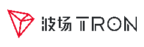

# ioBroker.TRONwallets
=================

## Description of Adapter
This adapter allows you to read the TRON Wallet data using the trxplorer API. Any number of wallets can be read. Also, the current price of BTC and TRX is pulled by the Binance API.

## SAFETY NOTICE
Please NEVER enter the private key in the input fields but ONLY the public wallet addresses of the TRON network.

### Donate
Of course I would be happy about a small donation in the form of TRX to the following wallet address :-)
TAGxUeB8LoHAhtQwhknAp5nH4tWBSSj1qn

## Changelog

### 0.0.7
* (Marcolotti) 
  - Add Token with calculation
  - Fixes error handling

### 0.0.6
* (Marcolotti) Pre-Release

### 0.0.1
* (Marcolotti) initial release

## License
The MIT License (MIT)

Copyright (c) 2018 Marcolotti <info@ct-j.de>

Permission is hereby granted, free of charge, to any person obtaining a copy
of this software and associated documentation files (the "Software"), to deal
in the Software without restriction, including without limitation the rights
to use, copy, modify, merge, publish, distribute, sublicense, and/or sell
copies of the Software, and to permit persons to whom the Software is
furnished to do so, subject to the following conditions:

The above copyright notice and this permission notice shall be included in
all copies or substantial portions of the Software.

THE SOFTWARE IS PROVIDED "AS IS", WITHOUT WARRANTY OF ANY KIND, EXPRESS OR
IMPLIED, INCLUDING BUT NOT LIMITED TO THE WARRANTIES OF MERCHANTABILITY,
FITNESS FOR A PARTICULAR PURPOSE AND NONINFRINGEMENT. IN NO EVENT SHALL THE
AUTHORS OR COPYRIGHT HOLDERS BE LIABLE FOR ANY CLAIM, DAMAGES OR OTHER
LIABILITY, WHETHER IN AN ACTION OF CONTRACT, TORT OR OTHERWISE, ARISING FROM,
OUT OF OR IN CONNECTION WITH THE SOFTWARE OR THE USE OR OTHER DEALINGS IN
THE SOFTWARE.
